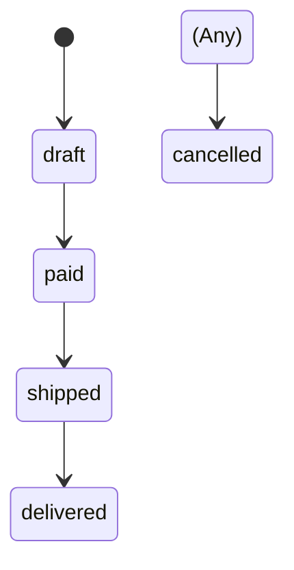

# Visualization

Complex state machines can be hard to understand just by looking at code. Go State Flow includes built-in generators to create visual diagrams of your FSM.

## Mermaid.js

Mermaid is a popular markdown-based diagramming tool supported by GitHub, GitLab, and many editors.

```go
fmt.Println(machine.ToMermaid())
```

**Output Example:**


## Graphviz (DOT)

If you need professional-grade graphs or image export, use the DOT format.

```go
fmt.Println(machine.ToGraphviz())
```

You can pip the output to `dot` to generate a PNG:

```bash
go run main.go | dot -Tpng > fsm_structure.png
```
